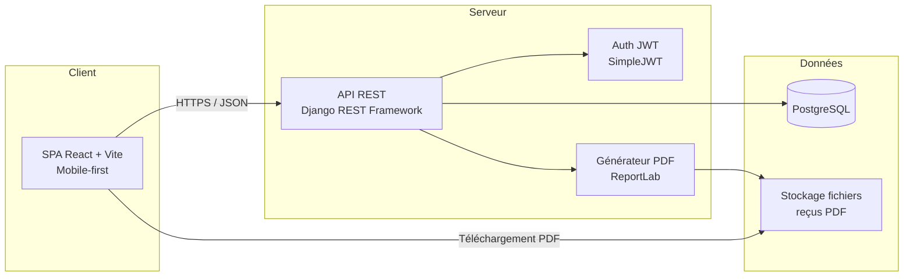
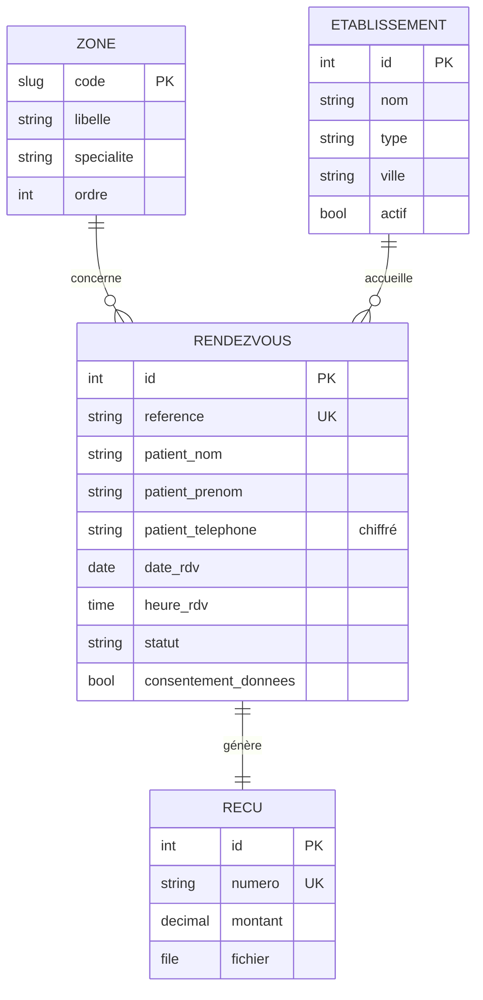
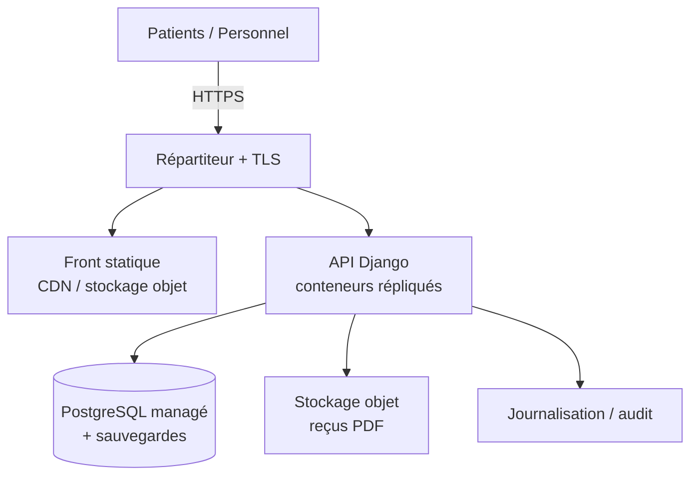

# Top S'ASSUR — Document d'architecture logicielle

> Application web d'assurance maladie centrée sur les pathologies prises en charge
> par la kinésithérapie (neurologie, traumatologie, rhumatologie, gynécologie,
> orthopédie, bien-être corporel), adaptée aux réalités du Cameroun et du secteur informel.

**Version** : 1.0 · **Statut** : conception validée + prototype fonctionnel
**Stack retenue** : React · Django REST Framework · PostgreSQL · JWT · ReportLab · Docker

---

## 1. Contexte et objectifs

Top S'ASSUR met en relation des patients et des établissements partenaires
(hôpitaux, cliniques, centres de kinésithérapie) pour organiser une prise en
charge kinésithérapeutique et produire un **reçu officiel** à chaque rendez-vous.

Objectifs directeurs :

| Objectif | Traduction technique |
|----------|----------------------|
| Parcours patient simple et progressif | Assistant (wizard) en 5 étapes, mobile-first |
| Interface attrayante et dynamique | React + animations CSS, carte corporelle interactive |
| Sécurité des données patients | JWT, chiffrement au repos des données sensibles, HTTPS, audit |
| Reçu PDF automatique | Génération serveur (ReportLab) à la validation |
| Adaptabilité au terrain camerounais | Faible bande passante, mobile, secteur informel, Mobile Money |

---

## 2. Vue d'ensemble de l'architecture

Architecture **3-tiers découplée** : un client React (SPA) consomme une API REST
Django, adossée à PostgreSQL. Les reçus PDF sont générés côté serveur et stockés
sur un volume de fichiers (objet cloud en production).



Séparation nette front/back : le même back-end peut plus tard servir une
application mobile native (Flutter / React Native) ou un canal USSD/SMS sans
rien changer au cœur métier.

---

## 3. Choix technologiques et justification

| Besoin | Choix | Pourquoi |
|--------|-------|----------|
| Front dynamique et responsive | **React 18 + Vite** | Écosystème large, build léger (~57 ko gzip), rendu rapide sur mobiles modestes |
| API métier | **Django + DRF** | Productivité, ORM robuste, admin intégré, sérialisation/permissions matures |
| Authentification | **JWT (SimpleJWT)** | Sans état, adapté à une API consommée par SPA et futur mobile |
| Base de données | **PostgreSQL** | Contraintes d'intégrité (créneaux uniques), transactions, montée en charge |
| Génération PDF | **ReportLab** | Génération serveur maîtrisée, fiable, sans dépendance navigateur |
| Chiffrement champ sensible | **Fernet (cryptography)** | Chiffrement authentifié simple à opérer, clé gérée hors code |
| Déploiement | **Docker Compose** | Reproductibilité dev → prod, portable Azure/AWS/GCP |

**Note sur OAuth2 vs JWT** : le cahier des charges mentionne « OAuth2 / JWT ».
Le prototype implémente l'authentification par **JWT** (jeton d'accès court +
rafraîchissement) pour les rôles administratifs. OAuth2 (Google, etc.) pourra
être ajouté comme fournisseur d'identité pour le personnel via un serveur
d'autorisation, sans modifier le modèle de permissions.

---

## 4. Modules fonctionnels

### Module 1 — Accueil
Page de présentation animée : bienfaits de la kinésithérapie, mission sociale,
appel à l'action « Commencer ». Statique côté données, dynamique côté rendu.

### Module 2 — Sélection de la zone douloureuse
Carte corporelle **interactive** (SVG) : 11 zones (cou, épaule, omoplate, dos,
fesse, hanche, cuisse, genou, jambe, cheville, pied). Chaque zone est reliée à
une spécialité kiné et enregistrée avec le rendez-vous.
`GET /api/zones/` fournit la liste depuis la table de référence `Zone`.

### Module 3 — Choix de l'établissement
Liste dynamique des établissements **actifs** avec cases à cocher.
Interface d'administration (`/admin`) pour **ajouter / supprimer** les
partenaires. `GET /api/etablissements/` (public) ; CRUD réservé au staff.

### Module 4 — Planification du rendez-vous
Sélection du **jour** (calendrier) puis d'un **créneau horaire**.
`GET /api/etablissements/{id}/disponibilites/?date=…` calcule les créneaux
libres (08h–17h, pas de 30 min) en excluant ceux déjà réservés. Une
**contrainte d'unicité** en base garantit qu'un créneau ne peut être pris deux fois.

### Module 5 — Validation et reçu
Bouton vert **« Enregistrer »**. Le back-end :
1. crée le rendez-vous (`POST /api/rendez-vous/`),
2. le confirme et **génère le PDF** (`POST /api/rendez-vous/{ref}/valider/`),
3. stocke le reçu et expose un lien de téléchargement
   (`GET /api/recus/{numero}/telecharger/`).
L'opération est **idempotente** : re-valider un rendez-vous ne recrée pas de reçu.

### Module Administration
Tableau de bord : nombre de rendez-vous, reçus émis, établissements actifs,
répartition par statut / établissement / zone (`GET /api/admin/statistiques/`,
JWT requis), plus la gestion des partenaires.

---

## 5. Modèle de données



Points de conception :

- **Minimisation des données** : aucun compte patient obligatoire ; seules les
  données strictement utiles au rendez-vous sont collectées.
- **`patient_telephone` chiffré au repos** via un `EncryptedCharField` (préfixe
  `enc:` en base). Un dump SQL n'expose pas les numéros.
- **Contrainte `creneau_unique_par_etablissement`** : `UNIQUE(etablissement,
  date_rdv, heure_rdv)` hors statut `ANNULE` → pas de double réservation, même
  en cas de requêtes concurrentes (protégée aussi par transaction + gestion du 409).
- **`reference` lisible** (`RDV-XXXXXX`) : identifiant partageable sans exposer
  d'identifiant séquentiel.

---

## 6. Sécurité et conformité

### Authentification & autorisation
- JWT (accès 30 min, rafraîchissement 1 j) pour le personnel/administration.
- Permissions par endpoint : lecture publique des zones/établissements ;
  création de rendez-vous ouverte ; **listing et statistiques réservés au staff**.
- Limitation de débit (throttling) anonyme et authentifié.

### Protection des données
- **Chiffrement au repos** des données sensibles (téléphone) — Fernet, clé
  `FIELD_ENCRYPTION_KEY` fournie par l'environnement (jamais dans le code).
- **Chiffrement en transit** : HTTPS obligatoire en production (redirection SSL,
  HSTS, cookies `Secure`).
- **Consentement explicite** exigé avant toute réservation.
- **Journal d'audit** applicatif (logger `audit`) sur la création de rendez-vous,
  la génération et le téléchargement des reçus.

### Conformité
- Alignement avec les principes de **minimisation, finalité, consentement et
  droit d'accès** (esprit RGPD, référence internationale).
- Prise en compte du cadre camerounais : **loi n° 2010/012 du 21 décembre 2010**
  relative à la cybersécurité et à la cybercriminalité, et rôle de l'**ANTIC**.
- **Rétention** : politique de conservation limitée des données de rendez-vous et
  purge/anonymisation programmée (à implémenter via tâche planifiée — voir §9).
- **Secret médical** : la zone douloureuse est une donnée de santé ; accès
  restreint au personnel autorisé, pas d'exposition publique.

> ⚠️ Les identifiants par défaut (`admin/admin1234`) et la dérivation de la clé de
> chiffrement depuis `SECRET_KEY` sont des commodités de **développement**. En
> production : mot de passe fort, `FIELD_ENCRYPTION_KEY` dédiée, secrets gérés par
> un coffre (Key Vault / Secrets Manager / Secret Manager).

---

## 7. Génération du reçu PDF

Génération **serveur** avec ReportLab au moment de la validation :

- En-tête vert de marque, numéro de reçu (`REC-XXXXXX`), date d'émission.
- Détails : référence RDV, patient, zone, établissement, ville, date/heure, montant (FCFA).
- Mentions légales de confidentialité et de non-valeur fiscale.
- Stocké dans `Recu.fichier` (volume `media` en dev, stockage objet en prod),
  téléchargeable via une route dédiée.

Le montant est paramétrable par appel ; il pourra être piloté par une grille
tarifaire par spécialité/établissement dans une itération ultérieure.

---

## 8. Adaptation aux réalités du Cameroun et du secteur informel

| Contrainte terrain | Réponse dans l'architecture |
|--------------------|------------------------------|
| Connexions mobiles, bande passante limitée | SPA légère (57 ko gzip), API JSON compacte, pas de dépendances lourdes |
| Smartphones d'entrée de gamme | UI mobile-first, composants simples, animations CSS peu coûteuses |
| Population du secteur informel, sans « compte » | Réservation **sans inscription** ; identité minimale (nom, prénom, téléphone) |
| Monnaie et paiement locaux | Montants en **FCFA** ; intégration future **Mobile Money** (MTN MoMo, Orange Money) via passerelle de paiement |
| Faible littératie numérique | Parcours guidé pas-à-pas, carte corporelle visuelle, boutons explicites |
| Multilinguisme | Interface en français ; `USE_I18N` activé pour ajouter l'anglais / langues locales |
| Coupures réseau | Reçu re-téléchargeable via sa référence ; évolutions possibles vers PWA hors-ligne / rappels SMS |

---

## 9. Hébergement, déploiement et scalabilité

Déploiement conteneurisé, portable sur **Azure / AWS / GCP** :



- **Front** : build statique servi par CDN (Azure Static Web Apps / S3+CloudFront / Cloud Storage).
- **API** : conteneurs sans état, mis à l'échelle horizontalement (App Service / ECS-Fargate / Cloud Run).
- **Base** : PostgreSQL **managé** (Azure Database / RDS / Cloud SQL) avec
  sauvegardes automatiques et réplicas de lecture au besoin.
- **Fichiers** : reçus sur stockage objet (Blob / S3 / GCS), servis via URL signées.
- **Secrets** : Key Vault / Secrets Manager / Secret Manager.
- **Tâches planifiées** : purge/anonymisation des données, rappels de rendez-vous
  (worker Celery + broker, ou tâches natives cloud).
- **Observabilité** : journaux centralisés, métriques, alertes.

---

## 10. Feuille de route par phases

| Phase | Contenu | État |
|-------|---------|------|
| **0 — Prototype** | 5 modules, admin, reçu PDF, sécurité de base, Docker | ✅ livré |
| **1 — Durcissement** | Secrets managés, HTTPS/domaine, sauvegardes, comptes personnel réels, tests automatisés | À faire |
| **2 — Paiement** | Intégration Mobile Money, grille tarifaire, statut de paiement sur le reçu | À faire |
| **3 — Notifications** | Rappels SMS/WhatsApp, confirmations, file d'attente | À faire |
| **4 — Mobile & offline** | PWA / application mobile, mode dégradé, canal USSD | À faire |
| **5 — Reporting avancé** | Statistiques par spécialité, exports, pilotage partenaires | À faire |

---

## 11. Risques et points de vigilance

- **Données de santé** : la zone douloureuse est sensible → gouvernance d'accès stricte, audit, DPA avec les établissements.
- **Concurrence sur les créneaux** : couverte par contrainte unique + transaction ; surveiller les 409 côté front (message clair déjà prévu).
- **Gestion de clé de chiffrement** : la rotation de `FIELD_ENCRYPTION_KEY` impose une procédure de re-chiffrement.
- **Disponibilité réseau** : prévoir dégradation gracieuse et rappels hors-ligne pour le public cible.
- **Souveraineté des données** : privilégier une région d'hébergement et des engagements contractuels adaptés au contexte local.

---

## 12. Arborescence du dépôt

```
top-sassur/
├── docker-compose.yml
├── .env.example
├── README.md
├── backend/                 # Django + DRF
│   ├── config/              # settings, urls, wsgi/asgi
│   └── core/                # modèles, API, PDF, chiffrement, seed
└── frontend/                # React + Vite
    └── src/
        ├── App.jsx          # assistant 5 étapes (modules 1–5)
        ├── pages/Admin.jsx  # administration
        └── components/BodyMap.jsx  # carte corporelle interactive
```

Le code du prototype implémente et **valide de bout en bout** ce document :
création de rendez-vous, chiffrement du téléphone au repos, refus des doubles
réservations, génération et téléchargement du reçu PDF, statistiques protégées par JWT.
